# What's new in CSS
#### Justin Slack

---
### First
## Thanks to our sponsors  

---


##### NML - nml.co.za


##### IO - io.co.za


##### Codespace Academy - codespace.co.za.za


##### Code Capsule - codecapsules.io
---
## The web has never been better 

---
## Interoperability has never been higher

"Interoperable" is fancy for "implemented with a high degree of parity (sameness) among the evergreen browsers", by which we mean Chrome, Edge, Safari, and Firefox.
---
## What does this mean in practical terms 
	[https://wpt.fyi/interop-2023?stable](https://wpt.fyi/interop-2023?stable) 

The WPT Dashboard, wpt.fyi, displays results for the web-platform-tests, or WPT, a group of test suites for many web platform specifications.

If the web platform were an engineering project, it'd be foolish not to have a test suite that's run regularly. The goal of the WPT Dashboard is to promote viewing the web platform as one entity and making identifying and fixing interoperability issues as easy as possible.

---
## What are these new features, and when can we use them?

The coordinated implementation of new features across browsers these days means we can start to
use these features pretty much as soon as they appear, which is excellent for keeping our stylesheets as
simple as possible. A few single-line properties can now replace multi-line, hacky solutions. In some
cases, newly available features may even mean we can remove JavaScript workarounds we once
needed to get around old limitations!
---
## So what are they

---
### Custom Properties
	allow us to define reusable values across our stylesheets

Also referred to as “CSS variables”, Custom properties can be used as an entire value for a property or as partial
values, like the h in an hsl() definition. We can also modify custom properties in JavaScript.

Since custom properties aren’t static like preprocessor variables, for example, in SASS, they open up many
opportunities for more flexible, dynamic styles. Custom properties offer far more than just being
“CSS variables”
---
### Logical Properties
	logical variants consider the writing mode and flow of text

For standard English text, we would trade “left/right” for “inline” and “top/bottom” for “block”. Instead of "padding-left", we can write "margin-inline-start". More about this later.

---

### New and Extended Selectors
	Specifically, the :`is`, `:where`, `:not`, and `:has` pseudo-classes

Pseudo-class selectors in CSS define a particular state of an element. They start with the colon character(:) and allow you to apply styles based on the interaction or behaviour of the element. Hover is probably the one you are most familiar with.
---

### Modern Responsive Design Features
	CSS math functions

Don't be alarmed! You don't have to do any maths. Although you can now do trigonometry functions in CSS, that's for another time.

We are interested in min(), max() and clamp(), functions
that accept multiple values, which makes them excellent companions for dynamically changing numeric
values wherever numbers are accepted. This includes dimension properties, gradients, background-size, box-shadow, font-size, and more.

---

### Container Queries
	The most widely requested feature in CSS

 Like media queries, they take the form of an at-rule. But they differ from media queries in that, instead of orchestrating changes at the  _viewport_  level, container queries allow any component or element to respond to a defined container’s  _width_. (Currently,  _height_  is still
being considered.) We can use a container query to change styles for a container’s children.

If that seems confusing, don't worry, we will go into more detail.
---
### What else is there?
	Things we won't discuss today except in passing

---
	@layers
	new colour spaces
	color-mix()
	color-scheme()
	relative colour syntax
	subgrid


	scope
	aspect-ratio
	media query range syntax
	dynamic viewpoint units
	scroll control properties
	page transitions
---
### A word about units of measure

You are probably familiar with px, em and rem, but many more units of measure are available in CSS.
---
## 36 in fact!

---

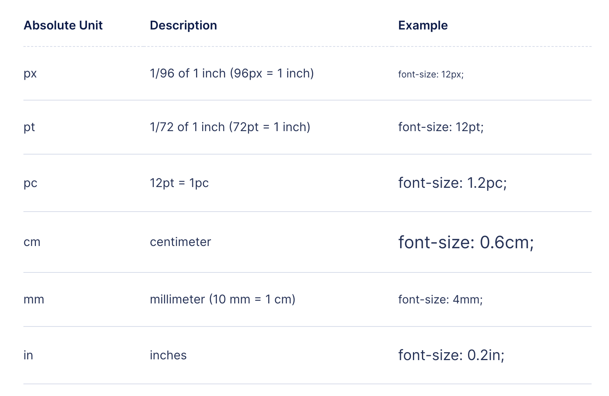


---


---

### New units we will use today
	fr, qw
---

### fr
	The new unit we can use with grid (and only grid)
	fr = fractional unit
---
### qw, qh, qmin, qmax, qi, qb
	Query units to be used with container queries
---
## Ok, let's get started
---
## But wait!!!
---

### Some of these properties aren't fully supported yet, so we must enable a Chrome experimental flag.
---

### Go to `chrome://flags`, search for “Experimental Web Platform features”, and enable the feature.

---
### Custom properties (variables)

---
	The wrong way
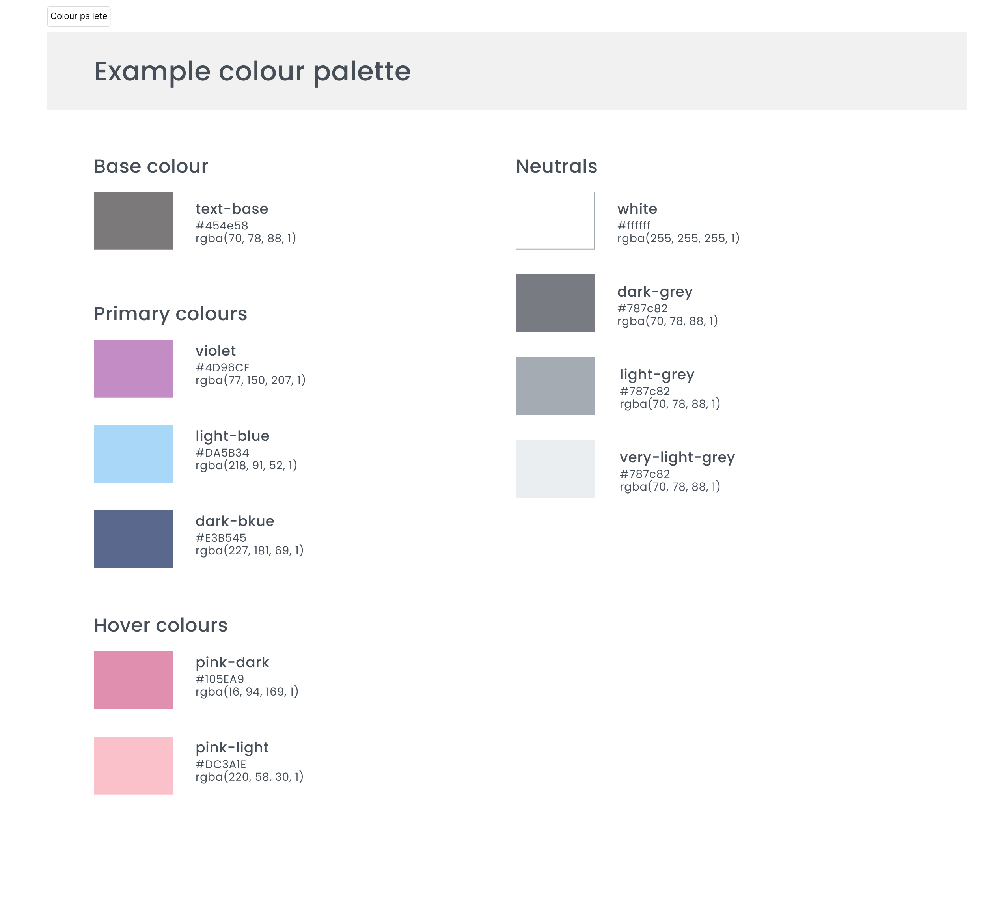


---
	The right way
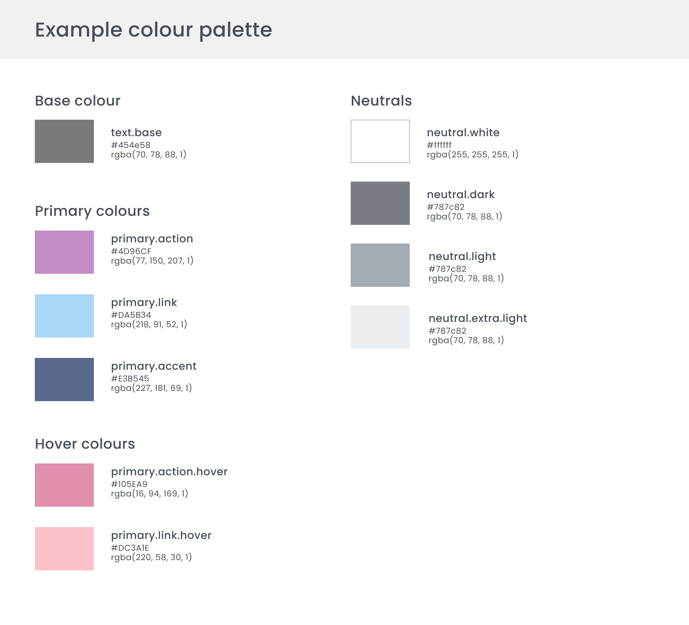


---
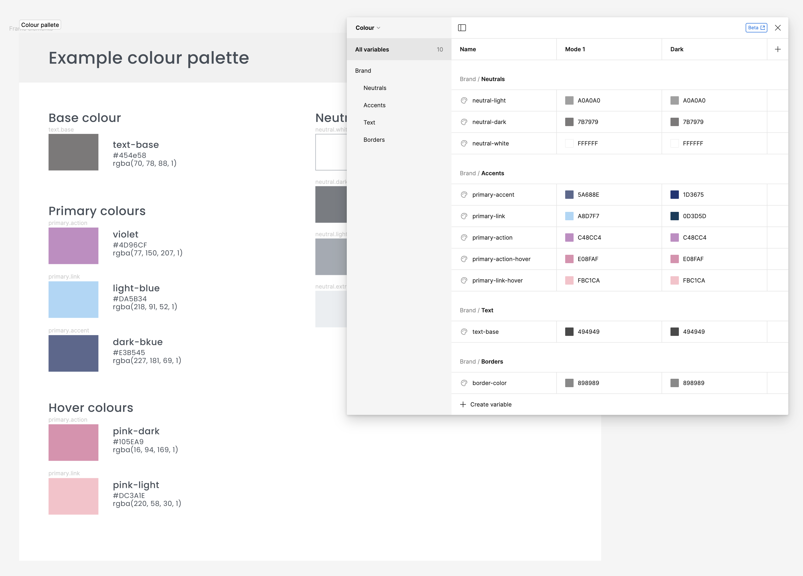


CSS variables are values that are defined in a CSS document with the goal of reusability and reducing redundancy in CSS values.

---
```
.section {
  border: 2px solid #235ad1;
}

.section-title {
  color: #235ad1;
}

.section-title > span {
  background-color: #235ad1;
}
```

In this snippet, the value #235ad1 is used three times. Imagine this for a large project with different CSS files, and you were asked to change the colour. The best thing you can do is the good old Find & Replace.

---

```
:root {
  --color-primary: #235ad1;
}
```

First, you need to add the double hyphen -- before a variable name. For now, we will define the variable in the root or the <html> element.

Isn’t that much, much cleaner than the previous snippet? The variable --color-primary is a global variable because we defined it in the :root element. However, we can also scope variables to certain elements throughout the document.
---
```
:root {
  --color-primary: #235ad1;
}

.section {
  border: 2px solid var(--color-primary);
}

.section-title {
  color: var(--color-primary);
}

.section-title > span {
  background-color: var(--color-primary);
}
```


---
###	 Logical Properties
	Use the direction of the HTML document

The basic idea of CSS logical properties is that we won’t use physical directions in CSS properties. Instead, we will use properties that depend on the direction of the HTML document. Those properties are called logical properties.

---


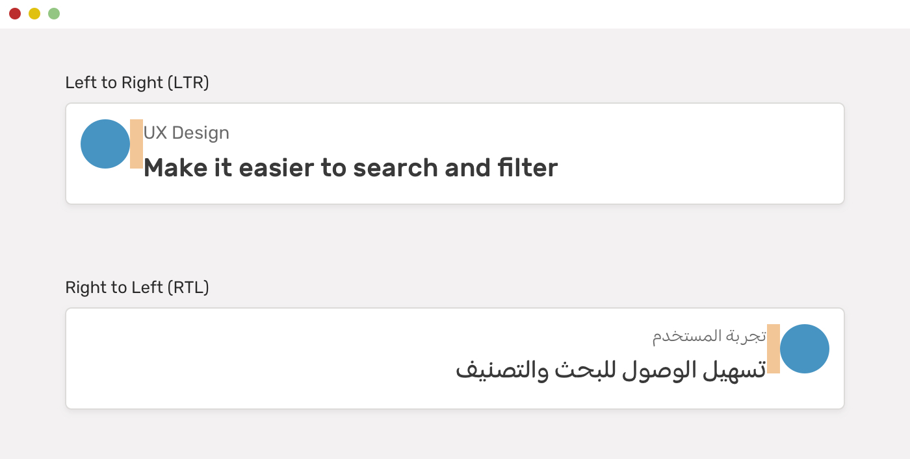

Example from: Ahmad Shadeed

We have a card that contains an avatar and text content. For left-to-right (LTR) layouts, the margin is on the right of the avatar. For right-to-left (RTL) layouts, the margin should be flipped (to the left).

Here is how we can do this without CSS logical properties.

---

```
.avatar {
  margin-right: 1rem;
}

html[dir="rtl"] .avatar {
  margin-right: 0;
  margin-left: 1rem;
}
```

Notice that margin-right is being reset to 0 for RTL layouts since it’s unnecessary. Imagine doing that for a large-scale project. CSS logical properties solve this for us.
---
```
.avatar {
  margin-inline-end: 1rem;
}
```
What does this mean? Inline refers to the horizontal dimension, and end refers to the direction of the text we read in. 

The dimension parallel to the flow of text within a line, i.e., the horizontal dimension in horizontal writing modes and the vertical dimension in vertical writing modes. For standard English text, it is the horizontal dimension.

---
```
.avatar {
  margin-block-end: 1rem;
}
```
Block refers to the vertical dimension, and again, the end refers to the direction. 

The dimension perpendicular to the flow of text within a line, i.e., the vertical dimension in horizontal writing modes and the horizontal dimension in vertical writing modes. For standard English text, it is the vertical dimension.
---
```
/* <length> values */
margin-block-end: 10px; /* An absolute length */
margin-block-end: 1em; /* relative to the text size */
margin-block-end: 5%; /* relative to the nearest block container's width */

/* Keyword values */
margin-block-end: auto;

/* Global values */
margin-block-end: inherit;
margin-block-end: initial;
margin-block-end: revert;
margin-block-end: revert-layer;
margin-block-end: unset;
```


---
### But what's writing mode?

The CSS writing modes module defines various international writing modes, such as left-to-right (e.g., used by Latin and Indic scripts), right-to-left (e.g., used by Hebrew or Arabic scripts), bidirectional (used when mixing left-to-right and right-to-left scripts), and vertical (e.g., used by some Asian scripts).

---

### Logical properties on MDN
	[https://developer.mozilla.org/en-US/docs/Web/CSS/CSS_logical_properties_and_values](https://developer.mozilla.org/en-US/docs/Web/CSS/CSS_logical_properties_and_values) 
---
### :not :is :where :has
	Conditional CSS

---
### `:not`
	The `:not()` CSS pseudo-class represents elements that do not match a list of selectors. 
---

### `:not`
	Since it prevents specific items from being selected, it is known as the negation pseudo-class.

The :not() CSS pseudo-class requires a comma-separated list of one or more selectors as its argument. 

The list must not contain another negation selector or a pseudo-element.
---
### `:not`
	`:not(.class)` will match anything that is not `.class` including `<html>` and `<body>`.

---
### `:not`
	Selectors can be chained; for example, `:not(.foo, .bar)` is equivalent to `:not(.foo):not(.bar)` 

---
### `:not`
	If any selector is invalid, the whole rule is invalid
	`:not(.foo, :banana)` will invalidate the entire rule

---
### `:is` and `:where`
	These functions receive a list of selectors as their argument and proceed to select any element that can be selected by one of the selectors in the list.
---

### `:is` and `:where`
	The specification defines :is() and :where() as accepting a “forgiving selector list”.

Unlike :not an invalid selector will not invalidate the entire list
---


---


You can probably intuit the functionality of :is() just by looking at it: it’s a means to test if an element is a certain thing, working essentially as a boolean like the if you’ll find in many programming languages. For example, in its simplest form, these two selectors are functionally the same:
---

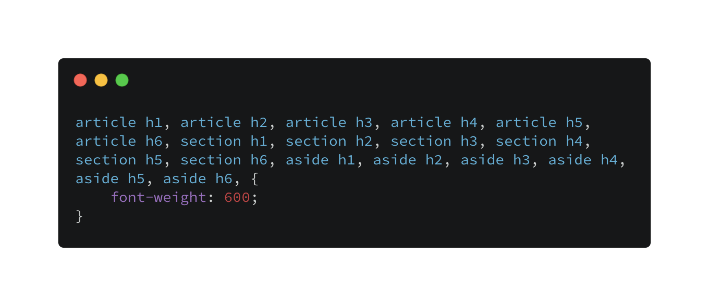


---

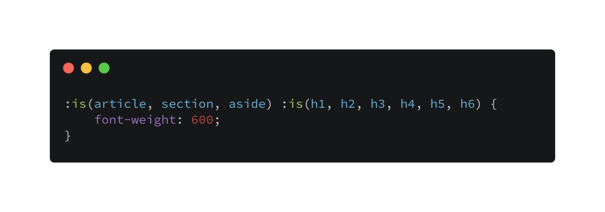


---
### `:has`
	In CSS, the ":has()" relational pseudo-class enables you to verify whether an element has particular child elements, select it if there are any matches, and apply styling accordingly.


---

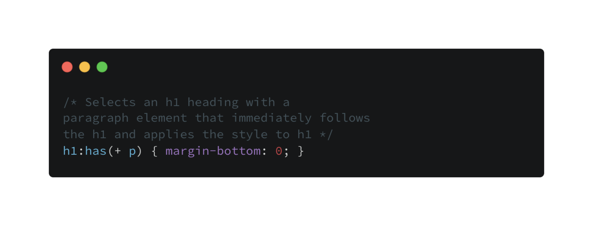


---
### `:has`
	If `:has()` is not supported in a browser, the entire selector block will fail unless :has() is in a forgiving selector list, such as in `:is()` and `:where()`.

---

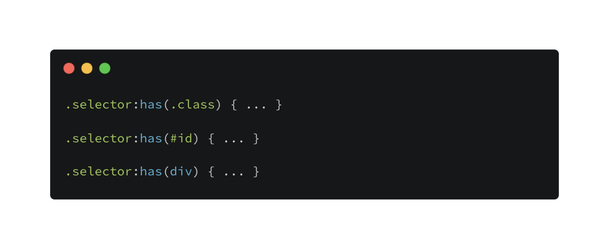


---

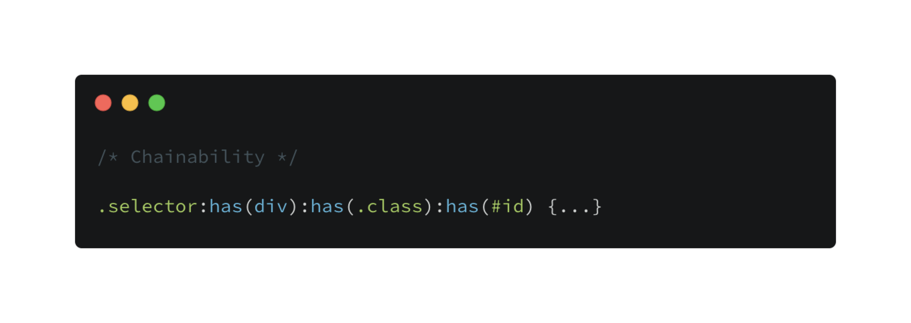


Chainability
---

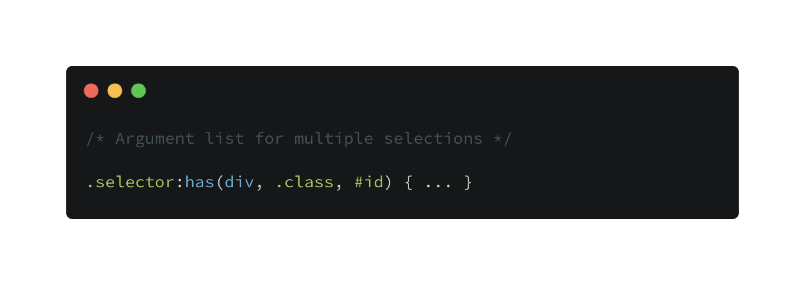


---

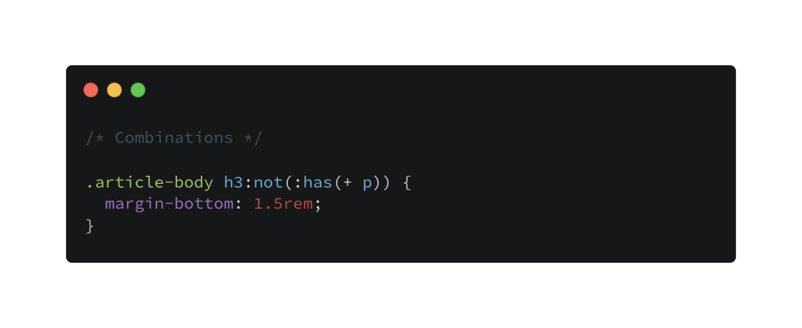


Move to exercise
---
### Container queries

---


---

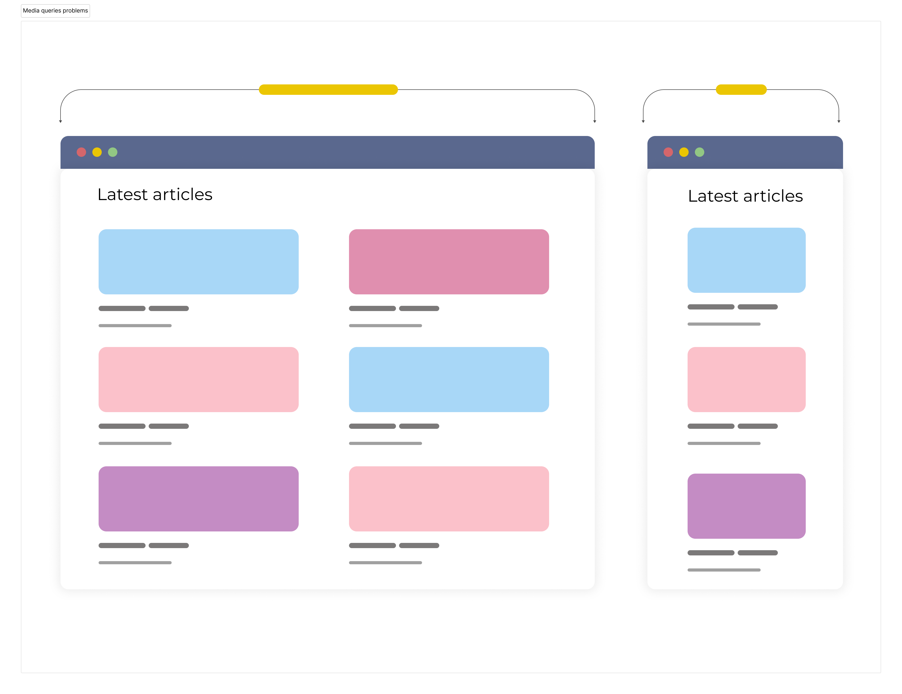


---


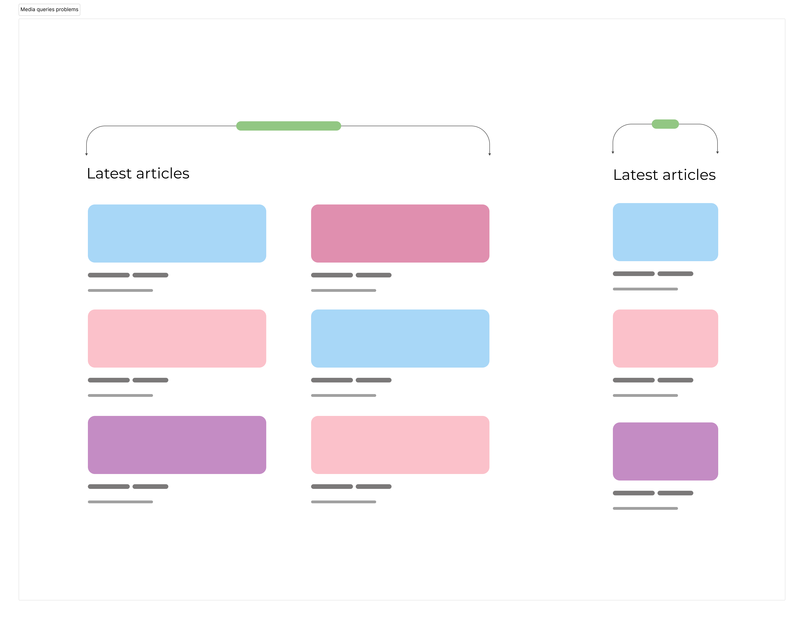


---

### Container queries
	Container queries allow defining rules for elements to respond to their ancestor container's available space. 

This differs from media queries which can only be based on the viewport.

---
### Container queries
	The primary benefit of container queries is creating more contextually appropriate layout rules that adapt to available space. 

With viewport media queries, rules are effectively orchestrated at the macro page level. But container queries allow responding to layout changes of microelements and components as their context shifts through variable placement in page layouts.
Note that we will concentrate on container sizing today. There are also container-style queries, but that's for another time, as browser support is very thin.
---
### Container queries
	Container elements must be explicitly defined, which at the base level is done through the `container-type` property.

---
```
.container {
   container-type: inline-size;
}
```

```
 @container (inline-size > 300px) {
   .container .child {
      padding: 2rem;
   }
}
```

The use of the term "inline" rather than "width" is from the precedent set by logical properties, which is why we learned them earlier.
---
### Container Query Units
|Unit |Value|
|----|----|
| cqw | 1% of a query container's width   |
| cqh | 1% of a query container's height   |
| cqi   | 1% of a query container's inline size   |
|  cqb  | 1% of a query container's block size   |
|  cqmin  |  The smaller value of either cqi or cqb  |
|  cqmax  |  The larger value of either cqi or cqb  |

Just as `1vw` equals `1%` of the viewport width, so does `1cqi` equal `1%` of a container's inline size.

---


---
### Considerations
	Make changes to the image size
	Font-size
	Spacing between the elements


